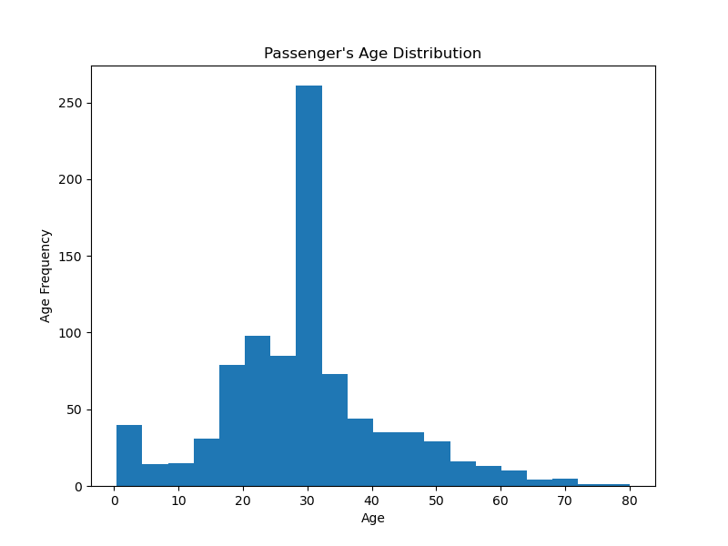
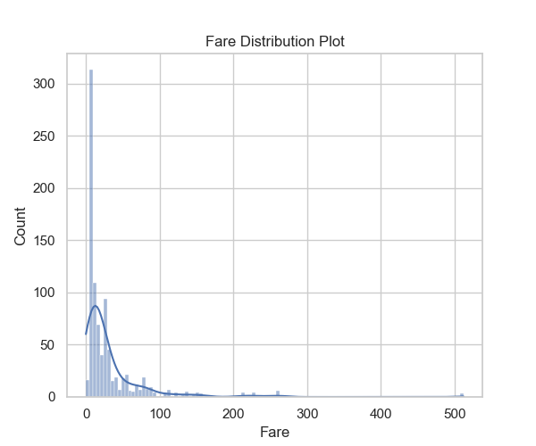
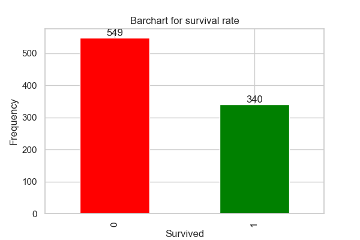

# Kaggle_Titanic_Prediction
This is a repository about predicting the survival of passengers aboard the Titanic dataset on Kaggle

 ### INTRODUCTION
-------------------------------------------------------------------------------------------------------------------------------------------------------
This is my first ever published machine learning model. The aim of this project is to show my understanding of data science processes. I explained my thought process and task execution from problem identification till model deployment. In addition, this project also demonstrates my skills in using Github for effective documentation of data science project.

--------------------------------------------------------------------------------------------------------------------------------------------------------
### PROBLEM STATEMENT
Using the details of the passengers on the maiden voyage of the Titanic Ship, the widely considered “unsinkable” ship. Build a predictive model that answers the question: “what sorts of people were more likely to survive?”

---------------------------------------------------------------------------------------------------------------------------------------------------------
### DATA SOURCE
The link to the original dataset is below.
https://www.kaggle.com/competitions/titanic.

-------------------------------------------------------------------------------------------------------------------------------------------------------------
### EXPLORATORY DATA ANALYSIS
The .info function is called on the train dataset to explore the number and type of features present in the dataset. For an efficient  analysis and ML model building, the colums with a missing  value needs to be taken care of.  

### DATA CLEANING
The columns with missing values have been addressed. The missing values in the 'Age' column were filled with the mean, while the missing values in the 'Cabin' column were filled with 'Unknown.' This decision was made considering that the 'Cabin' column might have limited impact on the ML model due to numerous unique values and missing values accounting for 77% of the column. Dropping these missing values would result in a significant loss of data; hence, the choice to fill them with 'Unknown.' However, future feature engineering could be performed on this column to enhance its suitability for the ML model building phase. The details of the feature engineering process can be found in a separate repository dedicated to that specific aspect. 

### VISUALIZATION

Data visualizations to show the distribution of the numeric variables 
Age Frequency                   |                  Fare Frequency    |      Survival rate
:------------------------------:|:------------------------------:    |:-------------------:
          |             |

### DATA PREPROCESSING
Sex and Embarked columns contains categorical variables that will not work in a ML model. To make the columns work in a ML model, the variable was encoded using the one hot encoder from Sklearn library. One hot encoder was chosen as the datapreprocessor of choice because of the dichotomous nature of the variable. The encoded columns were merged with the other features excluding features like passengers name and ID. The features that was used in the model building are  ['Survived', 'Pclass',	'Sex',	'Age',	'SibSp',	'Parch',		'Fare',	'Embarked']. The input and output variable was created and the data was splitted with the aid of train test split into their respective variables. 

### MODEL BUILDING AND PARAMETER TUNING
Logistic Regression was used to predict the outcome. The variable was scaled using the Min Max Scaler prior to fitting the the variable on the model. A subset of the entire dataset was set aside in the X_test variable to check the accuracy of the prediction. An accuracy score of 87.0% was gotten using the default parameters of the model, I then did hyper parameter tuning to increase the accuracy score and also reduce over and underfiting on the dataset. After parameter tuning, The accuracy score reamined at 87.0%. I then went ahead to deploy the model on the test set. Data Cleaning and preprocessing was done on the test test as well before the prediction was done.

